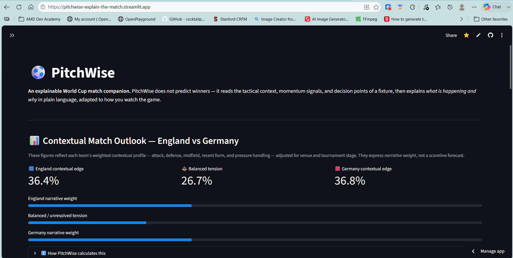
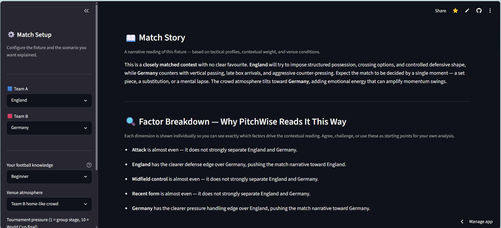
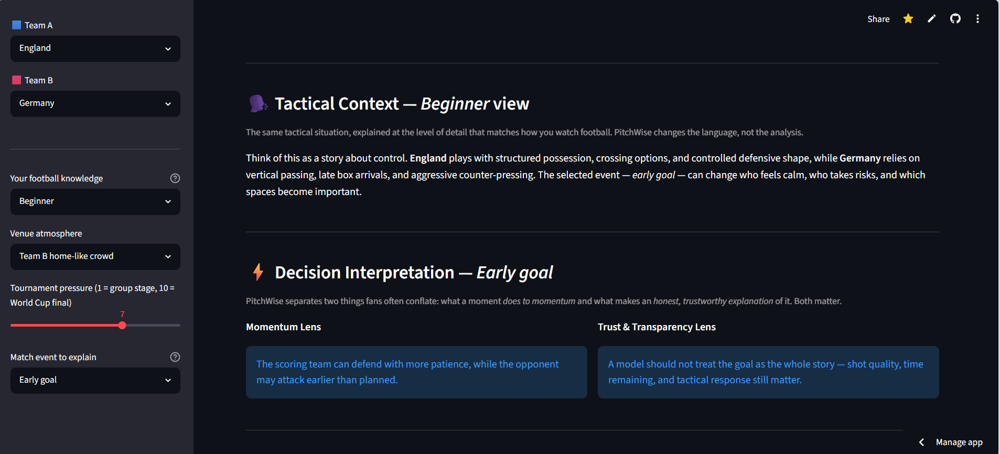

# PitchWise

[](LICENSE)
[](https://streamlit.io)
[](https://pitchwise-explain-the-match.streamlit.app)
[](https://github.com/harsh-18/pitchwise-explain-the-match)

> **An explainable World Cup match companion.**
> PitchWise does not predict winners — it explains what is happening in a match, why it is happening, and what it means for fans at every level of football knowledge.

---

## Live Demo

🌐 **App:** [https://pitchwise-explain-the-match.streamlit.app](https://pitchwise-explain-the-match.streamlit.app)

🎥 **Demo video (3 min):** [https://www.loom.com/share/da9a79c7eb4d4bd09986522b381cf253](https://www.loom.com/share/da9a79c7eb4d4bd09986522b381cf253)

### App Screenshots







---

## The Problem

The FIFA World Cup is the most-watched sporting event on earth — over 5 billion viewers across wildly different cultures, languages, and levels of football knowledge. Yet the tools available to fans are almost entirely prediction-focused: win probabilities, expected goals, league tables.

**None of them explain what is actually happening in the match — and why.**

- A first-time viewer does not understand why a team drops into a defensive shape after scoring
- A casual fan sees a red card and does not know whether it is truly decisive or manageable
- A VAR review happens and millions of fans feel confused, frustrated, and left out

The gap is not in data. It is in **explanation**.

---

## The Solution

PitchWise gives every fan a live, layered explanation of a World Cup fixture. Users configure:

- **Two teams** to compare
- **Fan knowledge level** — Beginner, Casual fan, or Analyst
- **Venue atmosphere** — neutral or crowd-tilted
- **Tournament pressure** — group stage to World Cup final
- **A match event** — red card, penalty, substitution, VAR review, defensive shape change, or early goal

PitchWise then produces:

| Output | What it does |
|---|---|
| **Contextual match outlook** | Shows each team's narrative weight based on five tactical dimensions — not a scoreline forecast |
| **Match Story** | A plain-language narrative of what kind of game this will be and what shapes it |
| **Factor Breakdown** | Every dimension shown individually so fans can agree or challenge the reading |
| **Tactical Context** | The same analysis re-expressed for the fan's chosen knowledge level |
| **Decision Interpretation** | Each match event explained through a momentum lens *and* a trust/transparency lens |
| **Why This Matters** | Frames the explanation in terms of fan understanding, transparent AI, and accessible analysis |

---

## AI / Technical Approach

PitchWise uses an **explainable contextual scoring model** — not a black-box predictor.

### Scoring model — five weighted dimensions

| Dimension | Weight | What it captures |
|---|---|---|
| Attack | 28% | Forward threat and goal-creation capacity |
| Defense | 22% | Defensive shape, recovery, and aerial duels |
| Midfield control | 22% | Pressing traps, passing rhythm, and phase transitions |
| Recent form | 18% | Tournament momentum and confidence under pressure |
| Pressure handling | 10% | Emotional and tactical composure in high-stakes moments |

### Context adjustments

- **Venue atmosphere** — adds a ±2.5 point boost to the home-crowd team
- **Tournament pressure slider** — amplifies or dampens the pressure-handling dimension, making high-stakes matches feel different from group games

### What the percentages mean

The contextual edge figures are a **narrative weight split** — they show which team's profile gives it more structural weight in the fixture, given the selected conditions. PitchWise does not claim to predict results.

### Narrative generation

The scoring gap drives a tiered match story:
- **Margin < 4%** → closely matched — decided by a single moment
- **Margin 4–10%** → moderate edge — the trailer can still disrupt with discipline
- **Margin > 10%** → structural advantage — the underdog must be opportunistic

Fan-level adaptation re-expresses the same analysis in language matched to how the fan watches the game — Beginner gets a story about control, Analyst gets phase-control and risk-transfer framing.

### Explainability design

Every factor is named, weighted, and visible. The model invites disagreement. There is no black box.

---

## Why This Matters for Soccer and the World Cup

The World Cup is not only about results. It is about **interpretation, emotion, debate, and shared meaning** — across every language, culture, and background.

1. **Fan understanding** — billions of viewers lack the tactical vocabulary to understand why decisions are made. PitchWise gives them the reasoning, not just the result.

2. **Trust in AI** — AI tools that produce predictions without explanation breed suspicion. Showing every input and weight openly is what trustworthy AI in sport looks like.

3. **Accessibility at global scale** — adapting the same analysis to beginner, casual, and analyst levels means the depth of football is available to everyone — not just those with access to expert commentary.

4. **Decision interpretation** — VAR reviews, red cards, and penalty calls are the most controversial moments in World Cup football. Separating the rule question from the emotional reaction is a service to every fan watching.

---

## IBM Technology Used

PitchWise was designed, built, and refined using **IBM Bob**, IBM's AI-supported development assistant. IBM Bob was used throughout the full prototyping cycle:

- Code generation and logic refinement
- UI design and section structure
- Explainability framing and narrative copy
- Documentation and README

---

## Project Files

| File | Purpose |
|---|---|
| [`app.py`](app.py) | Full Streamlit application — all logic, scoring model, and UI |
| [`requirements.txt`](requirements.txt) | Python dependencies |
| [`PROJECT_SUMMARY.md`](PROJECT_SUMMARY.md) | One-page brief for hackathon judges |
| [`CONTRIBUTING.md`](CONTRIBUTING.md) | Contribution guidelines |
| [`LICENSE`](LICENSE) | MIT License |

---

## How To Run

```bash
pip install -r requirements.txt
streamlit run app.py
```

No API keys. No external services. Runs fully offline.

---

## Demo Script

1. Open the app and select two World Cup teams (e.g. Argentina vs Brazil)
2. Set fan knowledge level to **Beginner** — observe plain language explanation
3. Switch to **Analyst** — observe the same analysis with tactical depth
4. Change the match event to **Red card** — observe the momentum and trust lenses
5. Adjust the pressure slider to **10 (World Cup final)** — observe how pressure changes the reading
6. Open the **"How PitchWise calculates this"** expander — show the transparent scoring model

---

## Future Improvements

- Add IBM Granite for live natural-language explanation generation
- Add LangFlow or LangChain orchestration for event-specific explanation chains
- Add multilingual explanations for global World Cup audiences
- Add real match event feeds and post-match report generation

---

## License

[MIT](LICENSE) © 2025 harsh-18
